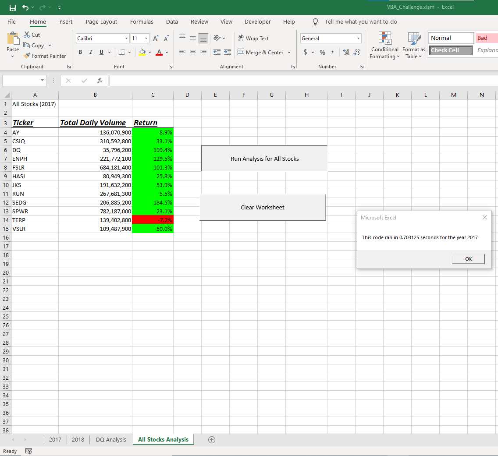
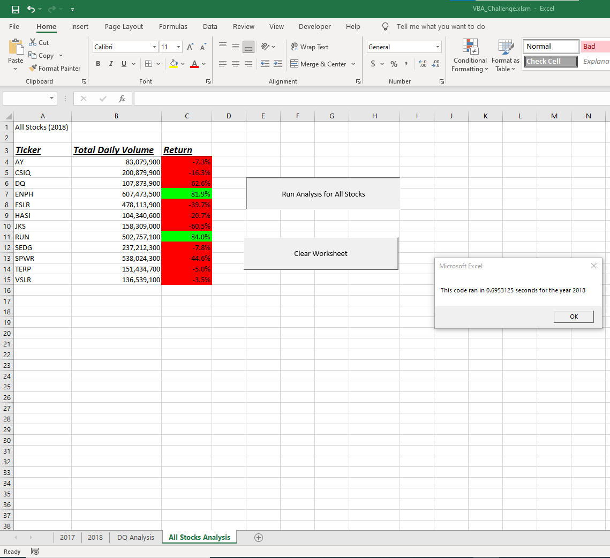
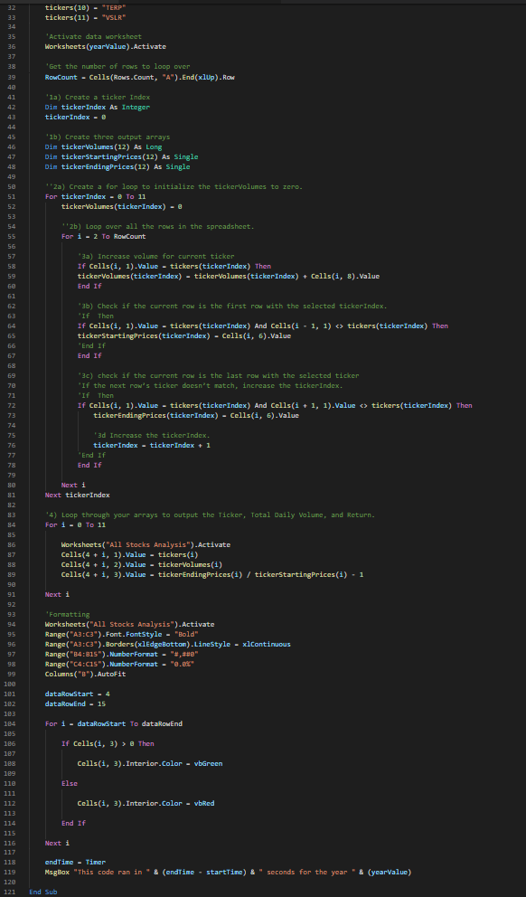
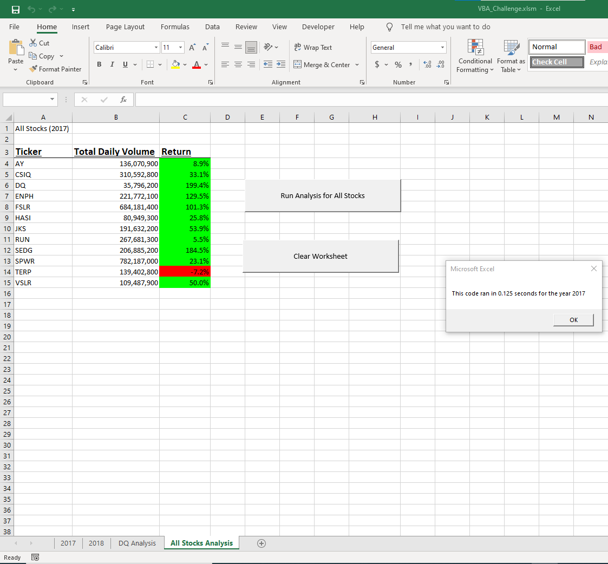
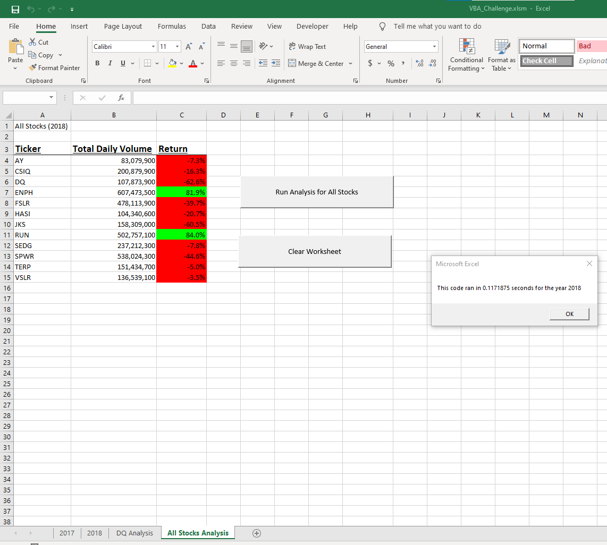

# Stock Analysis (Module 2 Challenge)

## Overview of Project

### Purpose
The purpose of this project was to expand the dataset to include the entire stock market over the last few years and so Steve would be able to analyze all of it with the click of a button. In addition to the expanded data set, Steve also wants the code to run faster than it did before. In order to accomplish this, the existing VBA code was refactored. After refactoring the code, the code was run to loop over all the data one time. The time it took to run through the code was measured both before and after refactoring the code to determine if the code refactoring had any impact on successfully making the VBA script run faster.

## Analysis and Results

### Data Analysis
In 2017, all but one stock had favorable returns. The only stock to see negatives in their returns was “TERP”. Despite having the least amount of Total Daily Volume, “DQ” saw the highest percentage of returns. See below for a more detailed breakdown of each stock’s results in 2017.

In 2018, all but two stocks saw unfavorable returns. The only two stocks that saw positives in their returns were “ENPH” and “RUN”. “TERP” was the only stock to consistently fall in returns in both years. Refer below for a more detailed breakdown of each stock’s results in 2018.

### Pre-Code Refactor
Before refactoring the code, the code run would take approximately .7 seconds to run for both the 2017 and 2018 datasets. See below:

### Post-Code Refactor
See below for the refactored code:

All things considered, ~.7 seconds is already relatively quick. However, refactoring the code did end up resulting in faster run times, approximately .1 seconds, for both datasets. This is around 85% faster than previously. See below:

## Summary

An advantage of refactoring the code is that the existing code provides a close enough template so that making changes to the code shouldn’t take long to edit. This makes it easier to maintain the code by amending portions of it without needing to start from scratch.  A possible disadvantage of refactoring the code is that if the existing application code is large and/or complex, it could be risky to edit. A mistake could cause the entire program to fail. Another potential disadvantage is that refactoring code could be time consuming if you do not know how much time it may take to complete the process.

In particular with this code, the advantage was very clear. The refactored code ran faster than the original. Having the existing original code as a template was helpful in making the necessary edits, however, these particular changes did take me some time to figure out. The only possible disadvantage I noticed was that at times, the Excel sheet felt sluggish to navigate around. This could possibly be due to all the macros involved.
